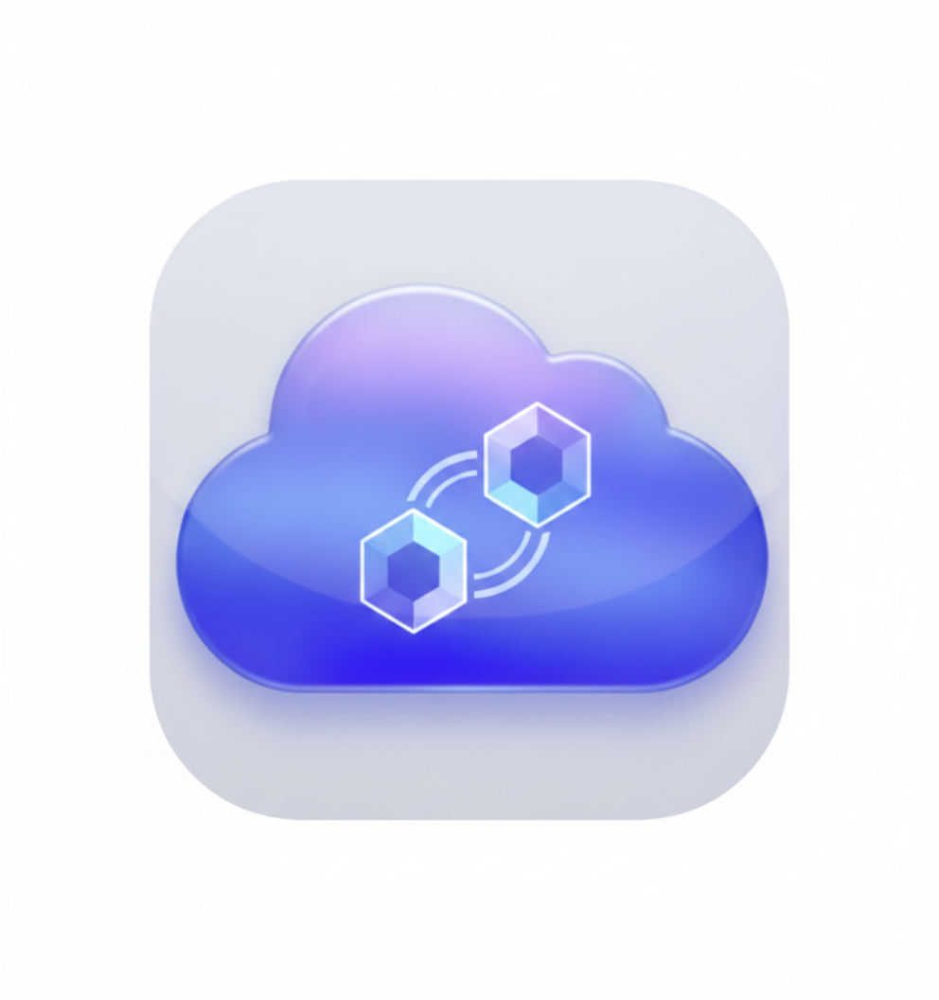

# XStream

<p align="center">
  
</p>

**XStream** 是一个用户友好的图形化客户端，用于便捷管理 Xray-core 多节点连接配置，优化网络体验，助您畅享流媒体、跨境电商与开发者服务（如 GitHub/ChatGPT/Gemini）。

---

## ✨ 功能亮点

- Apple 平台支持 System VPN / Packet Tunnel，macOS 与 iOS 共享统一的 Secure Tunnel 架构
- iOS 已支持 Packet Tunnel 扩展集成与设备侧启动流程，系统 VPN 列表可提前注册配置
- Home 页面提供实时连接监控，可显示下载、上传、延迟、内存与 CPU 等运行指标
- 内置 Logs / Help / About / Settings 的全局面包屑导航，桌面端与 iPhone 端页面结构更清晰
- 实时日志输出与诊断视图已针对长日志、桌面布局和 iPhone 可读性做过优化
- 支持多节点导入与切换，并已接入 `vless://` URI 导入与出站配置生成
- Windows/Linux 桌面端支持最小化到系统托盘；Windows 额外支持计划任务后台运行与 MSIX 打包

---

## 📦 支持平台

<!-- SUPPORT_MATRIX:START -->
| 平台 | 架构 | 测试状态 | 下载 |
|------|------|----------|------|
| macOS | arm64 | ✅ 已测试 | — |
| macOS | x64 | ⚠️ 未测试 | — |
| Linux | x64 | ⚠️ 未测试 | — |
| Linux | arm64 | ⚠️ 未测试 | — |
| Windows | x64 | ✅ 已测试 | — |
| Android | arm64 | ⚠️ 未测试 | — |
| iOS | arm64 | ✅ 已测试 | — |

> 自动更新：发布成功后，此表会由 CI 自动刷新为最新 nightly 下载链接。
<!-- SUPPORT_MATRIX:END -->

---

## 🖼️ Experience Snapshot

| 初始配置 | 同步配置 |
|---|---|
|  |  |

| 节点解锁 | 自定义节点表单 |
|---|---|
|  |  |

| 日志与诊断 |
|---|
|  |

---

## 🚀 快速开始

请根据使用身份选择：

- 📘 [用户使用手册](docs/user-manual.md)
- 🛠️ [开发者文档（macOS 开发环境搭建）](docs/dev-guide.md)
- 🧪 [Xcode 在线调试（macOS / iOS）](docs/xcode-online-debug.md)
- 🤖 [本机 MCP Server（Codex / Genmini）](docs/xstream-mcp-server.md)
- ☁️ [macOS 本机 GCS 挂载（OpenClaw）](docs/macos-gcs-mount.md)
- 📱 [iOS 设计文档](docs/ios-design.md)
- 🐧 [Linux systemd 运行指南](docs/linux-xray-systemd.md)
- 🪟 [Windows 计划任务运行指南](docs/windows-task-scheduler.md)

切换到 **隧道模式** 后，应用会使用 macOS Packet Tunnel（NEPacketTunnelProvider）接管系统流量。

更多平台构建步骤与桥接架构可参考下列文档：

- [Windows 构建指南](docs/windows-build.md)
- [Linux 构建须知](docs/linux-build.md)
- [iOS 设计文档](docs/ios-design.md#xray-core-%E9%9B%86%E6%88%90)
- [FFI 桥接架构](docs/ffi-bridge-architecture.md)

## 🔢 版本号变更

macOS / iOS 的版本号单一来源是 [pubspec.yaml](pubspec.yaml)：

```yaml
version: X.Y.Z+BUILD
```

- `X.Y.Z` 是展示版本号
- `BUILD` 是 macOS / iOS 的 build number

以后变更版本号时，只需要：

```bash
cd /Users/shenlan/workspaces/cloud-neutral-toolkit/xstream.svc.plus
# 1. 修改 pubspec.yaml 中的 version:
# 2. 同步 Flutter/Xcode 生成配置
make sync-macos-config
```

如果 Xcode Archive 里仍然显示旧版本号，执行：

```bash
cd /Users/shenlan/workspaces/cloud-neutral-toolkit/xstream.svc.plus
make reset-macos-xcode-version
```

不需要手动修改 Xcode 工程里的版本号。

## 📚 许可证与致谢

- 本项目整体遵循 [Apache 2.0](LICENSE) 开源协议。
- 核心网络功能依赖 [Xray-core](https://github.com/XTLS/Xray-core) ，遵循 Mozilla Public License 2.0。
- 桥接库 [libXray](https://github.com/XTLS/libXray) 使用 MIT License 发布。
