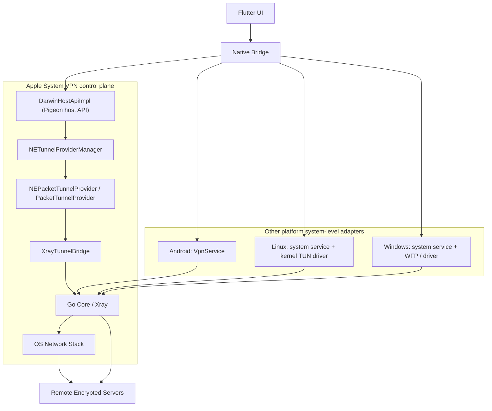

# Architecture Overview (Cross‑Platform)

This overview shows the current control path used by Xstream on each platform, with the Apple control plane called out explicitly because Packet Tunnel startup failures can happen before the provider or Go core is reached.

Notes:
- Apple platforms (macOS/iOS) MUST use `NEPacketTunnelProvider` as the system-level networking entry point.
- On macOS and iOS, the control path is `Flutter UI -> Native Bridge -> DarwinHostApiImpl -> NETunnelProviderManager -> PacketTunnelProvider -> XrayTunnelBridge -> Go Core / Xray`.
- For the full macOS implementation record, including process-level runtime shape, build artifacts, and file/function ownership, see [docs/macos-packet-tunnel-implementation.md](/Users/shenlan/workspaces/cloud-neutral-toolkit/xstream.svc.plus/docs/macos-packet-tunnel-implementation.md).
- Startup failures on Apple platforms can occur in manager loading, profile preparation, permission/authorization, or provider startup. They do not necessarily indicate a Go core failure.
- Other platforms use platform-appropriate system-level adapters, but keep the same product semantics: System VPN / Secure Tunnel / Packet Tunnel.
- `Native Bridge` isolates platform differences so the Flutter UI does not directly manage Network Extension or platform service details.

Current testing status:
- Go-side packet and bridge logic has code-level coverage in `go_core/` and related wrappers.
- Apple Packet Tunnel startup and authorization still rely mainly on manual validation. Use [docs/macos-menubar-regression-checklist.md](/Users/shenlan/workspaces/cloud-neutral-toolkit/xstream.svc.plus/docs/macos-menubar-regression-checklist.md) for current checks.

TODO / features:
- Add Apple-side automated regression coverage for `DarwinHostApiImpl`, `NETunnelProviderManager` preparation, and Packet Tunnel startup.
- Add startup-phase diagnostics so UI and logs can distinguish manager, authorization, provider, and engine failures.
- Keep platform adapters thin and preserve `NEPacketTunnelProvider` as the sole Apple system-level networking entry point.
