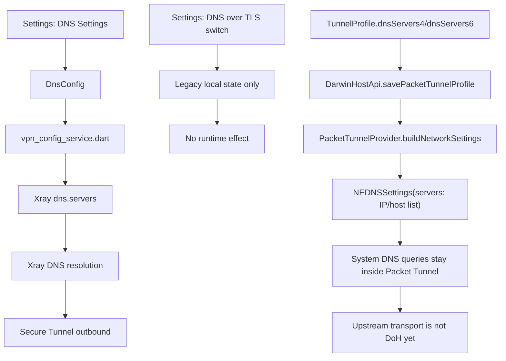
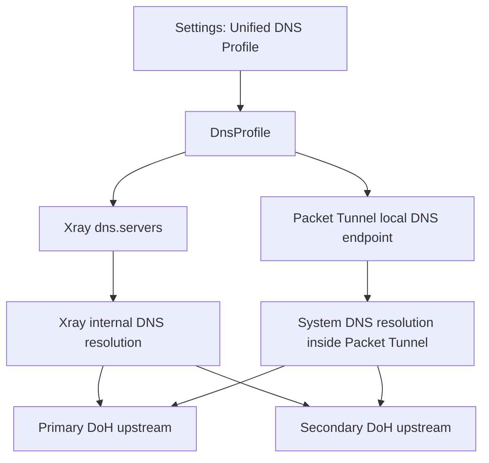

# DNS Secure Tunnel Design

本文档定义 Xstream 当前 DNS 现状、推荐架构、真实生效链路，以及可落地的 DoH 改造方案。文中所有语义均以 Secure Tunnel / System VPN / Packet Tunnel 为前提，不引入其他系统级网络路径。

## 1. 目标

Xstream 的 DNS 必须满足以下要求：

- DNS 作为 Secure Tunnel 的组成部分统一管理。
- Apple 平台系统级网络入口只保留 `NEPacketTunnelProvider`。
- 用户只维护一套 DNS 配置，避免 Xray 内置 DNS 与 Packet Tunnel 系统 DNS 分裂。
- 控制面文案必须准确反映真实能力，不保留“已展示但未生效”的开关。
- 为后续本地 Secure DNS proxy 预留清晰演进路径。

## 2. 当前实现现状

当前仓库内同时存在两条 DNS 配置链路：

1. Xray 内置 DNS
   - Flutter 设置页的 `DNS Settings` 写入 `DnsConfig`
   - 配置模板将其写入 Xray `dns.servers`
   - 默认值已经是 `https://.../dns-query`
   - 这一路当前实际属于 DoH

2. Packet Tunnel 系统 DNS
   - Darwin `TunnelProfile` 下发 `dnsServers4/dnsServers6`
   - `PacketTunnelProvider` 用 `NEDNSSettings(servers:)` 应用到系统
   - 这一层当前只支持服务器地址，不直接支持 `https://.../dns-query`
   - 因此当前系统 DNS 仍是“通过 Packet Tunnel 传输的普通 DNS 上游”

当前还存在一个控制面偏差：

- 设置页中的 `DNS over TLS` 开关并未接入真实运行时
- 它只保存本地状态和日志，没有改变 Xray DNS 模板或 Packet Tunnel 启动参数

## 3. 当前真实生效图



## 4. 推荐架构

推荐将 DNS 收敛为统一的 `DnsProfile` 概念，由同一组控制面字段驱动 Xray DNS 和 Packet Tunnel DNS：

```text
DnsProfile
- transport: doh | plain
- primaryEndpoint: string
- secondaryEndpoint: string
- effectiveTunnelDnsServers4: [string]
- effectiveTunnelDnsServers6: [string]
```

设计原则：

- `transport` 决定 Xray 上游 DNS transport，是 DoH 还是普通 DNS。
- `primaryEndpoint` / `secondaryEndpoint` 是唯一可编辑的上游端点。
- Packet Tunnel 当前阶段不直接接收 DoH URL，而是接收由统一配置派生出的 bootstrap resolver 地址。
- 后续引入本地 Secure DNS proxy 后，Packet Tunnel 只需要把系统 DNS 指向隧道内本地 DNS 入口。

## 5. 最终真实生效图

这是目标完成后的最终形态，不是当前仓库已完成状态：



该目标架构有两个关键点：

- 用户只维护一套 Secure DNS 配置
- 系统 DNS 与 Xray DNS 使用同一套上游策略

## 6. 真正可落地的 DoH 开关设计

### 6.1 控制面语义

设置页开关应改为 `DNS over HTTPS`，而不是 `DNS over TLS`。

原因：

- 当前产品的用户可编辑端点是 `https://.../dns-query`
- 这对应的是 DoH 语义，而不是 DoT
- DoT 需要单独的上游模型与握手参数，当前仓库没有真正实现

### 6.2 开关行为

`DNS over HTTPS` 开关应具备以下真实行为：

1. 开启时
   - 将 `primaryEndpoint` / `secondaryEndpoint` 规范化为 `https://.../dns-query`
   - Xray 模板输出 DoH resolver
   - Packet Tunnel 继续使用由该 endpoint 推导出的 bootstrap resolver 作为系统 DNS

2. 关闭时
   - 将 `primaryEndpoint` / `secondaryEndpoint` 规范化为普通 DNS 服务器地址
   - Xray 模板输出普通 DNS resolver
   - Packet Tunnel 继续使用同一组普通 resolver

### 6.3 第一阶段可落地边界

在本地 Secure DNS proxy 尚未引入前，DoH 开关的真实能力边界如下：

- Xray 内置 DNS transport 会被真实切换
- Packet Tunnel 系统 DNS 仍使用 bootstrap resolver 地址
- 因此“System VPN 的系统 DNS 也完全使用 DoH”这一点，要等本地 Secure DNS proxy 落地后才能成立

这必须在文案和代码中都保持诚实。

## 7. 可落地的改造方案

### 第一阶段：统一配置模型与控制面

第一阶段可以立即实施，目标是消除语义混乱和假开关：

1. 删除 `TunDnsConfig` 的独立 DNS 概念
2. 统一由 `DnsConfig` 管理 DNS transport 与端点
3. 设置页只保留一套 DNS 配置入口
4. 将 `DNS over TLS` 改成 `DNS over HTTPS`
5. 开关真正驱动 Xray DNS 端点格式和运行时配置
6. Packet Tunnel 的 `dnsServers4/dnsServers6` 由统一配置派生
7. 运行时不再并列追加硬编码公共 resolver 作为 fallback

第一阶段收益：

- UI、配置、运行时语义一致
- 用户只维护一套 DNS 配置
- 为第二阶段本地 Secure DNS proxy 预留单一配置源

### 第二阶段：本地 Secure DNS proxy

第二阶段补齐系统 DNS 的最终目标架构：

1. 在 Packet Tunnel 扩展或 Go runtime 内启动本地 DNS proxy
2. `NEDNSSettings` 指向隧道内本地 DNS 入口
3. 本地 DNS proxy 将查询转发到 DoH 上游
4. 系统 DNS 与 Xray DNS 共享同一上游策略

第二阶段完成后，DoH 将覆盖：

- Xray 内置 DNS
- System VPN 进入 Packet Tunnel 的系统 DNS

## 8. 可实施的目标架构

从实施顺序看，推荐采用以下目标架构拆分：

### 8.1 Flutter 控制面

- `DnsConfig` 统一承载：
  - transport
  - primary endpoint
  - secondary endpoint
- 设置页只展示：
  - `DNS Settings`
  - `DNS over HTTPS`

### 8.2 Xray 配置生成

- Xray `dns.servers` 只从统一 `DnsConfig` 生成
- `transport == doh` 时输出 `https://.../dns-query`
- `transport == plain` 时输出普通 DNS 服务器地址

### 8.3 Packet Tunnel 启动参数

- 当前阶段：
  - `TunnelProfile.dnsServers4/dnsServers6` 使用统一配置派生出的 bootstrap resolver
- 目标阶段：
  - `TunnelProfile.dnsServers4/dnsServers6` 改为本地 DNS endpoint

### 8.4 本地 Secure DNS proxy

- 监听 Packet Tunnel 内部地址
- 接收系统 DNS 查询
- 统一转发到 DoH 上游
- 作为 Secure Tunnel 的组成部分运行

## 9. 本次代码改造范围

本次改造只实现第一阶段，不声称第二阶段已完成：

- 已实现：
  - 统一 DNS 配置模型
  - 统一设置页文案与状态
  - 真正可生效的 DoH 控制面
  - Packet Tunnel bootstrap DNS 从统一配置派生

- 未实现：
  - Packet Tunnel 内本地 Secure DNS proxy
  - 系统 DNS 直接经本地 proxy 转 DoH 上游

## 10. 后续实施建议

后续若继续推进第二阶段，优先级建议如下：

1. 在 `go_core/` 侧实现本地 Secure DNS proxy，便于跨平台复用
2. 将 Darwin `TunnelProfile.dnsServers4/dnsServers6` 固定为本地 DNS endpoint
3. 统一 Xray DNS 与系统 DNS 的健康检查、主备切换和日志采样
4. 补充 end-to-end System VPN DNS 验证用例
