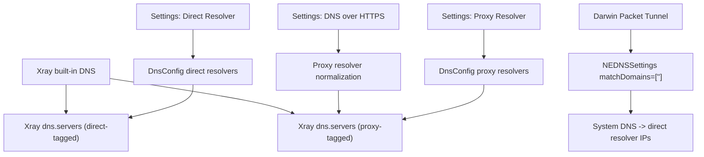
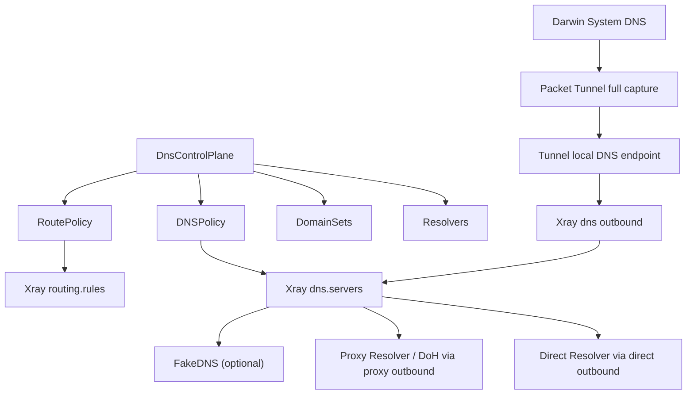

# DNS Secure Tunnel Design

本文档定义 Xstream 在 macOS 与 iOS 上的统一 DNS 控制面目标、当前实现边界与阶段计划。所有语义均以 Secure Tunnel / System VPN / Packet Tunnel 为前提，不引入其他系统级网络路径。

## 1. 目标

Xstream 的 DNS 设计目标如下：

- 统一 DNS 控制面，单一配置源生成：
  - `Resolvers`
  - `DomainSets`
  - `DNSPolicy`
  - `RoutePolicy`
- `DNSPolicy` 与 `RoutePolicy` 必须从同一份策略模型生成，避免域名解析路径和实际转发路径分裂。
- macOS 与 iOS 继续使用 `NEPacketTunnelProvider` 作为唯一系统级网络入口。
- Darwin 平台系统 DNS 继续由 `NEDNSSettings.matchDomains = [""]` 与 `matchDomainsNoSearch = true` 全接管。
- `Proxy Resolver` 的 DoH 必须使用 Xray 正常路由模式的 `https://.../dns-query`，确保查询不旁路、不泄露，并与 outbound 路由一致。
- 优先保持单数据面，不默认引入第二个本地 DNS 守护进程。
- `FakeDNS` 默认关闭，仅对显式策略集合启用。

## 2. 统一 DNS 控制面模型

目标模型如下：

```text
DnsControlPlane
- resolvers
  - direct: ResolverSet
  - proxy: ResolverSet
  - fake: FakeDnsResolverSet (optional)
- domainSets
  - direct: [domain matcher]
  - proxy: [domain matcher]
  - fake: [domain matcher]
- dnsPolicy
  - direct domains -> direct resolver
  - fake domains -> fake resolver
  - fallback -> proxy resolver
- routePolicy
  - direct domains/IPs -> direct outbound
  - fake domains/IPs -> proxy outbound + FakeDNS aware sniffing
  - fallback -> proxy outbound
```

### 2.1 Resolvers

- `Direct Resolver`
  - 允许普通 DNS 或后续扩展到 DoT
  - 用于本地化域名、局域网域名、系统基础连通性域名，以及明确声明为 direct 的域名

- `Proxy Resolver`
  - 用于默认 Secure DNS 上游
  - 在开启 `DNS over HTTPS` 时，统一规范为 `https://.../dns-query`
  - DoH 查询必须强制通过 `proxy` outbound

- `Fake Resolver`
  - 默认关闭
  - 仅对显式 `fakeDomains` 启用
  - 后续需配合 TTL/LRU 管理、诊断日志与风险提示

### 2.2 DomainSets

统一控制面中的域名集合分为三类：

- `directDomains`
- `proxyDomains`
- `fakeDomains`

要求：

- 三组域名集合必须由同一份配置源维护
- 不能在 DNS 生成逻辑和路由生成逻辑中各自硬编码一份
- `directDomains` 需要至少覆盖：
  - `localhost`
  - `*.local`
  - dotless names
  - Apple / LAN / captive 等系统基础域名集合

### 2.3 DNSPolicy

目标策略：

- 命中 `directDomains` -> 使用 `Direct Resolver`
- 命中 `fakeDomains` 且 `FakeDNS` 启用 -> 使用 `Fake Resolver`
- 其他域名 -> 使用 `Proxy Resolver`

### 2.4 RoutePolicy

目标策略：

- 命中 `directDomains` 或其派生 IP -> `direct` outbound
- 命中 `fakeDomains` -> 配合 FakeDNS 与 sniffing 进入代理路径
- 其他域名 / IP -> `proxy` outbound

## 3. 数据面原则

### 3.1 Darwin 全接管

macOS 与 iOS 继续使用：

- `NEDNSSettings(servers: ...)`
- `matchDomains = [""]`
- `matchDomainsNoSearch = true`

这是 Darwin 上正确的全接管方式，应当保留。

### 3.2 单数据面优先

当前默认方案不是 `127.0.0.1/::1 + LocalDnsStub`。

目标优先方案如下：

- Packet Tunnel 下发隧道内专用 DNS 地址
- 系统 DNS 查询进入 Packet Tunnel
- DNS 查询由 Xray `dns` outbound 承接
- `dns` outbound 再按统一控制面选择 direct / proxy / fake 上游

但与 `release/v0.3.0` 对比后可以确认：

- `release/v0.3.0` 的 Darwin 出货路径是 `matchDomains = [""]` 全接管 + 系统 DNS 直接指向 resolver IP
- 该路径在当前节点与 Secure Tunnel 启动链路下更稳定
- 因此当前出货默认仍保留 resolver IP 模式

只有在验证发现 Xray 能稳定承接系统 DNS 请求后，才会把“隧道内专用 DNS 地址 + `dns` outbound”提升为 Darwin 默认路径；若仍不稳定，再评估补充本地 DNS stub。

### 3.3 DoH 路由原则

`Proxy Resolver` 的 DoH 仅允许使用：

- `https://.../dns-query`

不使用：

- `https+local://.../dns-query`

原因：

- 前者会进入 Xray 路由系统
- 后者会绕过路由直接走本地自由出站，不符合“DNS 请求不旁路、与路由一致”的目标

## 4. 当前实现现状

### 4.1 已实现

当前仓库已经具备以下基础能力：

1. `DnsConfig` 作为主要 DNS 配置源，区分：
   - `Direct Resolver`
   - `Proxy Resolver`
   - `DNS over HTTPS`
2. Xray `dns.servers` 已支持：
   - Direct nameserver
   - Proxy nameserver
   - `https://.../dns-query`
3. Darwin `PacketTunnelProvider` 已全接管系统 DNS：
   - `matchDomains = [""]`
   - `matchDomainsNoSearch = true`
4. Darwin 系统 DNS 当前默认仍指向统一控制面生成的 direct resolver IP，保持与 `release/v0.3.0` 一致的稳定路径。
5. Xray 内置 DNS 继续由统一控制面生成，DoH 仍通过 Xray 正常路由模式生效。
6. Xray nameserver tag 已区分：
   - direct resolvers -> `direct`
   - proxy resolvers -> `proxy`

### 4.2 当前仍未完成

以下能力尚未完整落地：

- `DomainSets` 已进入统一模型，但仍未做成可配置的控制面输入
- `DNSPolicy` 与 `RoutePolicy` 已由同一份控制面对象生成，但 Darwin 系统 DNS 仍未默认切换到内置 `dns` 数据面
- `FakeDNS` 已有默认关闭的配置骨架，但尚未进入正式的出货流程
- Apple / LAN / captive 等 direct 域名集合仍不完整
- Darwin 的“隧道内专用 DNS 地址 + `dns` outbound”仍处于验证阶段，尚未作为默认出货路径
- DNS 专项健康检查、泄露诊断、环路诊断日志尚未系统化

## 5. 当前真实生效图



## 6. 推荐目标架构

目标架构如下：



### 6.1 核心原则

- 不新增第二套系统级网络入口
- 不默认引入第二个本地 DNS 守护进程
- 同一份控制面同时生成 DNS 规则与路由规则
- `Proxy Resolver / DoH` 只走 `proxy` outbound
- Darwin 系统 DNS 与 Xray 内置 DNS 以统一控制面为目标，但当前出货默认仍优先保留 `release/v0.3.0` 证明稳定的 resolver IP 路径

## 7. FakeDNS 设计

`FakeDNS` 保持以下边界：

- 默认关闭
- 仅对显式 `fakeDomains` 启用
- 后续实现时要求：
  - TTL 管理
  - LRU 映射回收
  - 与 sniffing `destOverride = ["fakedns"]` 联动
  - 明确文档风险提示

风险提示必须覆盖：

- 本地 DNS cache 可能保留 FakeDNS 结果
- Xray 停止后，依赖 FakeDNS 的域名可能短时不可用

## 8. 阶段计划

### 阶段 1：控制面收敛

目标：

- 把 resolver 与 direct/proxy/fake 域名集合抽象成统一结构
- 消除多条 DNS 配置生成路径
- 修正文档与设置页语义

交付：

- `DnsControlPlane` / `DomainSets` / `DNSPolicy` / `RoutePolicy` 模型
- 设置页仍保持现有布局，但能力来自统一控制面

### 阶段 2：Xray 配置单源生成

目标：

- 由统一控制面生成：
  - `dns.servers`
  - `routing.rules`
  - nameserver tags
  - direct/proxy/fake 域名策略

交付：

- 移除模板中的次级 DNS 策略源
- 移除遗留 fallback 与 split-brain 路径

### 阶段 3：Darwin 数据面对齐

目标：

- 保持 Darwin 全接管
- Packet Tunnel 与 Xray 继续共用单数据面
- 增加 DNS 健康检查与重试

交付：

- Packet Tunnel 启动后的 DNS health checks
- 以 `release/v0.3.0` 为稳定基线，对比验证 Darwin 何时可切换到隧道内 DNS 端点
- 本地 DNS 端点环路与泄露诊断日志

### 阶段 4：FakeDNS 与诊断增强

目标：

- 默认关闭的 FakeDNS 进入统一控制面
- 增加运行时风险提示、排障日志与验证文档

交付：

- FakeDNS 策略
- sniffing 联动
- 文档中的验证与排障章节

## 9. 验证要求

实现完成后至少需要验证以下项目：

### 9.1 DNS 生效验证

- 运行态 `config.json` 中 `dns.servers` 是否按控制面生成
- `Proxy Resolver` 在启用 DoH 时是否为 `https://.../dns-query`
- direct/proxy/fake 域名策略是否在 `dns` 和 `routing` 中一致

### 9.2 Darwin 系统级验证

- `Packet Tunnel` 已连接
- `matchDomains = [""]` 全接管生效
- 系统 DNS 查询进入隧道内 DNS 端点
- DoH 查询仍随 `proxy` outbound 转发

### 9.3 排障验证

需要可区分以下故障层：

- Packet Tunnel 未接管
- Xray DNS 配置错误
- DNS 环路
- Proxy Resolver 不可达
- Direct Resolver 不可达
- FakeDNS 残留映射

## 10. 当前实现边界说明

当前文档是权威基线。若实现与文档不一致，以修正实现或修正文档为准，不允许长期保留“文档说已完成、代码实际上未完成”的状态。
