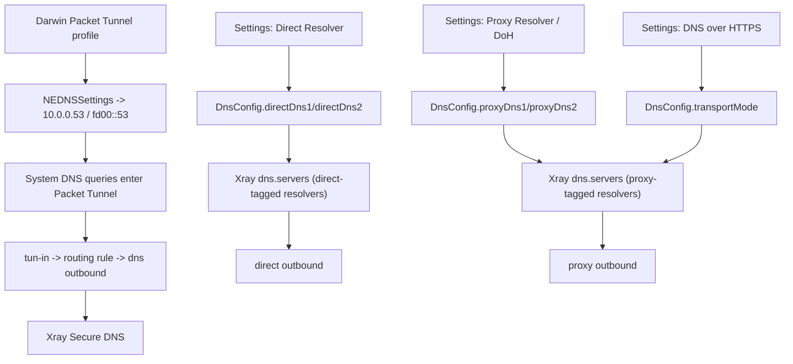
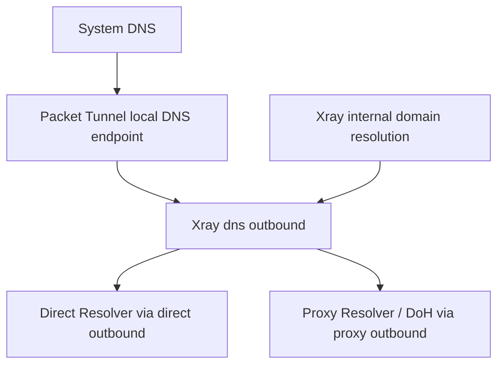
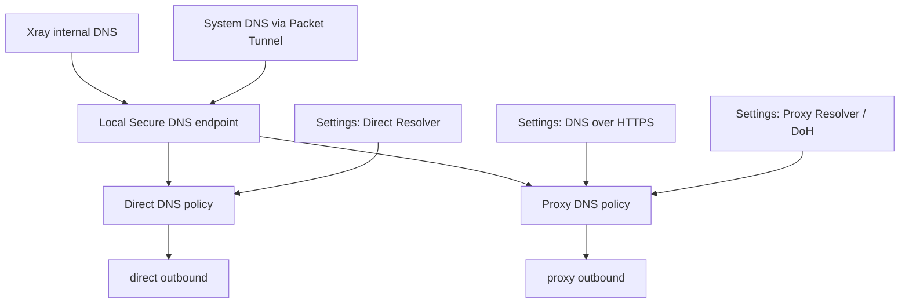

# DNS Secure Tunnel Design

本文档定义 Xstream 当前 DNS 控制面与数据面设计，并作为后续 Secure DNS 改造的权威基线。所有语义均以 Secure Tunnel / System VPN / Packet Tunnel 为前提，不引入其他系统级网络路径。

## 1. 目标

Xstream 的 DNS 必须满足以下要求：

- DNS 是 Secure Tunnel 的组成部分，而不是独立旁路。
- Apple 平台系统级网络入口只保留 `NEPacketTunnelProvider`。
- 设置页统一维护两组解析器：
  - `Direct Resolver`
  - `Proxy Resolver / DoH`
- `DNS over HTTPS` 只控制 `Proxy Resolver` 的传输方式。
- 系统 DNS、Xray Secure DNS、Packet Tunnel 本地 DNS 端点使用同一控制面来源。
- 实现要优先满足长期合规、可审计、可维护。

## 2. 统一 DNS 模型

当前仓库以 `DnsConfig` 作为唯一 DNS 配置源，统一承载：

```text
DnsConfig
- directDns1 / directDns2
- proxyDns1 / proxyDns2
- transportMode: plain | doh
- darwinPacketTunnelDnsServers4: [10.0.0.53]
- darwinPacketTunnelDnsServers6: [fd00::53]
```

语义定义：

- `Direct Resolver`
  - 用于直连 DNS policy
  - 当前主要服务 `localhost`、`.local`、dotless 等本地化域名
  - 在 Android 和其他尚未接入本地 Secure DNS 端点的平台上，也可继续作为系统 DNS 覆盖来源

- `Proxy Resolver`
  - 用于 Secure DNS 的默认上游
  - 当 `DNS over HTTPS` 开启时，规范化为 `https://.../dns-query`
  - 当 `DNS over HTTPS` 关闭时，规范化为普通 DNS 服务器地址

## 3. 当前实现现状

当前实现已经进入第二阶段的第一步，但只在 Darwin Packet Tunnel 路径上完成了本地 Secure DNS 端点接入。

### 3.1 已实现

1. `DnsConfig` 统一提供 Direct / Proxy 两组解析器和 `DNS over HTTPS` 开关。
2. Xray `dns.servers` 已按两组上游生成：
   - Direct Resolver
   - Proxy Resolver / DoH
3. Darwin `PacketTunnelProvider` 下发的系统 DNS 不再直接指向公网解析器，而是指向隧道内本地 DNS 端点：
   - `10.0.0.53`
   - `fd00::53`
4. Xray 路由规则将 Packet Tunnel 内发往本地 DNS 端点的 `53` 端口查询导向 `dns` outbound。
5. Xray nameserver tag 将 Direct Resolver 上游固定走 `direct` outbound，将 Proxy Resolver 上游固定走 `proxy` outbound。

### 3.2 当前 Direct DNS policy

当前默认的 Direct DNS policy 是保守策略，用于本地化和系统级基础域名：

- `localhost`
- `*.local`
- dotless names

其余未命中该策略的域名，默认交给 `Proxy Resolver`。

这一步已经满足：

- 系统 DNS 查询先进入 Packet Tunnel 内部本地 Secure DNS 端点
- 本地 Secure DNS 逻辑再按 Direct / Proxy policy 选择上游

### 3.3 尚未实现

以下能力仍属于后续阶段，不应在 UI 或文档中误写为已完成：

- 用户可编辑的 Direct / Proxy 域名策略集合
- Android 上与 Darwin 同等级的本地 Secure DNS 端点
- Windows / Linux 的系统级本地 Secure DNS 端点接入
- 统一的 DNS 健康检查、上游探测与指标面板

## 4. 当前真实生效图



## 5. 推荐架构

推荐架构保持一个事实边界：

- Packet Tunnel 内不额外新增独立的用户态 DNS 守护进程
- 本地 Secure DNS 端点直接由 Xray `dns` outbound 与路由规则承接

这样可以减少并行数据面，降低维护复杂度，同时保持 Secure Tunnel 语义集中。

推荐结构如下：



## 6. 最终真实生效图

最终目标不是增加新的系统级入口，而是在同一 Packet Tunnel 内继续扩展策略和可观测性：



最终态的增强点应包括：

- Direct / Proxy 域名策略可编辑
- 上游健康检查与切换可观测
- 多平台系统 DNS 数据面保持一致

## 7. 真正可落地的 DoH 开关设计

### 7.1 控制面语义

设置页中的 `DNS over HTTPS` 表示：

- 只控制 `Proxy Resolver`
- 不改变 `Direct Resolver`
- 不改变 Packet Tunnel 本地 DNS 端点地址

### 7.2 开关行为

开启时：

- `Proxy Resolver` 规范化为 `https://.../dns-query`
- Xray Secure DNS 的默认上游改为 DoH
- Darwin Packet Tunnel 中未命中 Direct policy 的系统 DNS 查询，也会经过该 DoH 上游

关闭时：

- `Proxy Resolver` 规范化为普通 DNS 服务器地址
- Xray Secure DNS 的默认上游改为普通 DNS
- Darwin Packet Tunnel 中未命中 Direct policy 的系统 DNS 查询，也会按同一 Proxy Resolver 逻辑处理

### 7.3 当前真实边界

`DNS over HTTPS` 现在已经不再是空开关，但它的真实覆盖范围是分平台的：

- macOS / iOS:
  - 覆盖 Xray Secure DNS
  - 覆盖 Packet Tunnel 本地 Secure DNS 路径中的 Proxy Resolver 分支

- Android:
  - 目前覆盖 Xray Secure DNS
  - 系统 VPN DNS 仍以 Direct Resolver 派生值为主

- Windows / Linux:
  - 目前覆盖 Xray Secure DNS
  - 尚未接入统一的系统级本地 Secure DNS 端点

## 8. 可落地的改造方案

### 第一阶段：统一配置模型与控制面

第一阶段已完成：

1. 删除独立的 `TunDnsConfig` 语义
2. 统一由 `DnsConfig` 管理 Direct / Proxy / DoH
3. 设置页提供 `Direct Resolver` 与 `Proxy Resolver`
4. `DNS over HTTPS` 只控制 `Proxy Resolver`
5. 去除运行时硬编码公共 fallback

### 第二阶段：Packet Tunnel 本地 Secure DNS 端点

第二阶段第一步已完成于 Darwin：

1. 系统 DNS 指向 Packet Tunnel 内本地 DNS 端点
2. Packet Tunnel 内 DNS 查询通过 `tun-in` 路由到 Xray `dns` outbound
3. Direct Resolver 上游固定走 `direct` outbound
4. Proxy Resolver 上游固定走 `proxy` outbound

### 第三阶段：策略与多平台扩展

后续建议顺序：

1. 把 Direct / Proxy 域名策略从固定规则扩展为可配置模型
2. 把 Android 接入与 Darwin 等价的本地 Secure DNS 端点
3. 为 Windows / Linux 引入统一的系统级 DNS 数据面
4. 增加 Secure DNS 健康检查、日志和指标

## 9. 可实施的目标架构

### 9.1 Flutter 控制面

- `Proxy Resolver`
- `Direct Resolver`
- `DNS over HTTPS`

### 9.2 Xray 配置生成

- `dns.servers` 生成 Direct / Proxy 两组 nameserver
- Direct nameserver 带固定 policy domains
- Proxy nameserver 作为默认上游
- routing rules:
  - `tun-in` 的本地 DNS 端点流量 -> `dns`
  - Direct nameserver tag -> `direct`
  - Proxy nameserver tag -> `proxy`

### 9.3 Packet Tunnel 启动参数

- Darwin:
  - `dnsServers4 = [10.0.0.53]`
  - `dnsServers6 = [fd00::53]`

- Android:
  - 当前继续使用 Direct Resolver 派生的系统 DNS 值

### 9.4 本地 Secure DNS 数据面

- 本地 DNS 端点由 Packet Tunnel 接管
- DNS 查询由 Xray `dns` outbound 处理
- 不新增第二套系统级网络入口

## 10. 平台覆盖边界

### macOS / iOS

- 已接入 Packet Tunnel 本地 Secure DNS 端点
- 系统 DNS 进入 Packet Tunnel 后按 Direct / Proxy policy 处理
- `DNS over HTTPS` 已进入真实数据面

### Android

- `Proxy Resolver / DoH` 已进入 Xray Secure DNS
- 系统 VPN DNS 仍由 Direct Resolver 派生
- 尚未接入本地 Secure DNS 端点

### Windows / Linux

- 当前以运行时 Xray Secure DNS 为主
- 尚未完成与 Apple Packet Tunnel 等价的系统级本地 Secure DNS 数据面

## 11. 实施备注

当前 Darwin 实现把“本地 Secure DNS proxy”收敛为 Packet Tunnel 内的本地 DNS 端点加 Xray `dns` outbound，而不是新增独立守护进程。这样做的原因是：

- 保持 Secure Tunnel 数据面集中
- 避免第二套 DNS 运行时
- 继续使用现有 Xray DNS、routing、outbound 观测与维护路径

后续若需要增强能力，应优先扩展该链路，而不是新增并行 DNS 组件。
