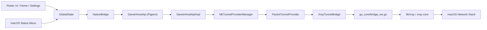
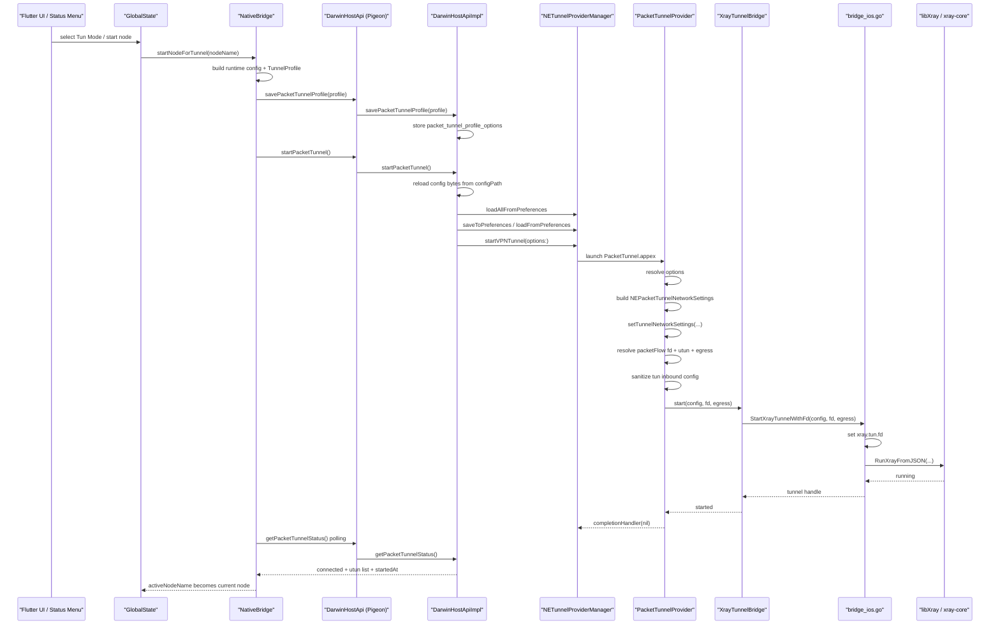

# macOS Packet Tunnel Implementation Record

This document records the current macOS Packet Tunnel design and implementation in Xstream.
It is a code-aligned maintenance note for future debugging, refactoring, and App Store readiness work.

## 1. Scope

This document covers only the macOS System VPN path:

- Flutter UI and status menu entry points
- Flutter to macOS host control plane
- `NETunnelProviderManager` preparation and lifecycle
- `PacketTunnelProvider` startup, network settings, fd / `utun` handoff
- Go / `libxray` bridge and runtime dependencies
- build, signing, entitlement, and embedded runtime resources

This path is the only permitted system-level networking entry on macOS:

- `NEPacketTunnelProvider`
- `NETunnelProviderManager`
- `Packet Tunnel`

No user-space TUN helper, sudo route modification, or alternate system networking path is part of this design.

## 2. High-Level Shape



There are two distinct bridge layers:

1. Flutter control plane:
   Flutter -> `NativeBridge` -> Pigeon `DarwinHostApi` -> `DarwinHostApiImpl`
2. Packet Tunnel data plane:
   `PacketTunnelProvider` -> `XrayTunnelBridge` -> `StartXrayTunnelWithFd` -> `libXray`

### Runtime process view

From an operations perspective, the current macOS Packet Tunnel path is not "one app process plus one external xray process".
It is two main macOS processes, and the tunnel engine runs inside the extension process:

| Runtime item | Example path | Separate process | Role in current implementation | How to observe |
| --- | --- | --- | --- | --- |
| Host app | `/Applications/xstream.app/Contents/MacOS/xstream` | Yes | Flutter UI, state menu integration, Pigeon host bootstrap, Packet Tunnel control requests | `ps -axo pid,ppid,etime,command \| rg '/Applications/xstream.app/Contents/MacOS/xstream'` |
| Packet Tunnel extension | `/Applications/xstream.app/Contents/PlugIns/PacketTunnel.appex/Contents/MacOS/PacketTunnel` | Yes | Runs `NEPacketTunnelProvider`, applies network settings, resolves fd / `utun`, starts tunnel engine | `ps -axo pid,ppid,etime,command \| rg 'PacketTunnel.appex/Contents/MacOS/PacketTunnel'` |
| `libxray_bridge.dylib` | `PacketTunnel.appex/Contents/Frameworks/libxray_bridge.dylib` | No | Go-built native bridge loaded by the extension with `dlopen` / `dlsym` | check extension bundle contents and Packet Tunnel logs |
| `go_core/bridge_ios.go` | compiled into `libxray_bridge.dylib` | No | Exposes `StartXrayTunnelWithFd` / stop / error functions to Swift | inspect exported bridge code, not process list |
| `libXray` | linked through `go_core/go.mod` replace | No | Native wrapper that runs Xray from JSON inside the same process | inspect Go deps and bridge build output |
| `xray-core` | linked under `libXray` | No | Actual tun inbound and outbound engine running in-process inside `PacketTunnel.appex` | inspect Packet Tunnel behavior and bridge logs, not a standalone PID |
| Host-side standalone `xray` binary | `xstream.app/Contents/Resources/xray/xray` | Usually no in TUN mode | Runner-side proxy/runtime resource path, not the current Packet Tunnel data-plane entry | `ps -axo ... \| rg '/xray|xray '` only relevant for proxy-mode checks |
| `xstream-mcp-server` | `xstream.app/Contents/Resources/runtime-tools/xstream-mcp/xstream-mcp-server` | Yes | Auxiliary runtime MCP tooling, unrelated to Packet Tunnel data plane | `pgrep -fl 'xstream-mcp-server'` |

Operationally, the most important distinction is:

- `PacketTunnel.appex` is the real System VPN data-plane process
- `bridge_ios.go -> libXray -> xray-core` executes inside that same `PacketTunnel.appex` process
- there is no extra standalone `xray` process for the macOS Packet Tunnel path
- a separate `xray` process can still exist in proxy mode, but that is a different runtime path

## 3. Main Components

### 3.1 Flutter entry points

- `lib/screens/home_screen.dart`
  - main connect / disconnect button
  - decides whether to call `startNodeForTunnel()` or proxy-mode start
- `lib/screens/settings_screen.dart`
  - mode switch UI
  - TUN status refresh via `getPacketTunnelStatus()`
- `lib/main.dart`
  - receives macOS status menu actions
  - routes menu actions back into the same Flutter start / stop / reconnect flow
- `lib/utils/global_config.dart`
  - single source of truth for connection mode
  - `setTunnelModeEnabled()` and `setConnectionMode()`

### 3.2 Flutter to macOS host bridge

- `lib/utils/native_bridge.dart`
  - `startNodeForTunnel()`
  - `stopNodeForTunnel()`
  - `startPacketTunnel()`
  - `stopPacketTunnel()`
  - `getPacketTunnelStatus()`
- `pigeons/darwin.dart`
  - typed interface definition
- `lib/app/darwin_host_api.g.dart`
  - generated Dart client
- `darwin/Messages.g.swift`
  - generated Swift message handlers

### 3.3 macOS host app control plane

- `macos/Runner/MainFlutterWindow.swift`
  - registers `DarwinHostApiImpl`
- `darwin/MacosHostApi.swift`
  - persists tunnel profile
  - loads / creates `NETunnelProviderManager`
  - refreshes `NETunnelProviderProtocol`
  - starts / stops Packet Tunnel
  - exposes status back to Flutter
- `macos/Runner/AppDelegate.swift`
  - owns macOS status menu
  - sends menu actions to Flutter through `com.xstream/native`
  - does not directly start Packet Tunnel

### 3.4 Packet Tunnel extension

- `macos/PacketTunnel/PacketTunnelProvider.swift`
  - `NEPacketTunnelProvider` implementation
  - applies `NEPacketTunnelNetworkSettings`
  - resolves system tunnel fd and `utun`
  - calls `XrayTunnelBridge`
- `macos/PacketTunnel/Info.plist`
  - Packet Tunnel extension metadata
- `macos/PacketTunnel/PacketTunnel.entitlements`
  - Packet Tunnel entitlement and App Group

### 3.5 Go and runtime bridge

- `go_core/bridge_ios.go`
  - exports C-compatible functions used by Packet Tunnel
  - starts and stops `libXray` with the live Packet Tunnel fd
- `bindings/bridge.h`
  - shared C header for exported bridge functions
- `libXray/`
  - local replacement of `github.com/xtls/libxray`
- `go_core/go.mod`
  - depends on `github.com/xtls/xray-core v1.260206.0`
  - replaces `github.com/xtls/libxray` with local `../libXray`

## 4. Control Plane Call Chain

The current macOS control plane is:

```text
Home / Settings / Status Menu
-> GlobalState
-> NativeBridge.startNodeForTunnel()
-> DarwinHostApi.savePacketTunnelProfile()
-> DarwinHostApi.startPacketTunnel()
-> DarwinHostApiImpl
-> NETunnelProviderManager
-> startVPNTunnel(options:)
```

### Startup sequence diagram



### 4.1 UI and menu converge in Flutter

The project intentionally keeps one logical start path.

- Home screen start / stop uses `NativeBridge` directly.
- Settings page only changes mode and refreshes status.
- Status menu does not directly manipulate `NETunnelProviderManager`.
  It sends action payloads back to Flutter, and Flutter reuses the same `NativeBridge` path.

This means:

- `Tun Mode` and `Proxy Mode` are unified at the Flutter state layer.
- menu start / stop / reconnect and Home start / stop use the same TUN logic.
- mode switching does not auto-restart the tunnel; it forces reconnect.

### 4.2 `NativeBridge.startNodeForTunnel()`

`lib/utils/native_bridge.dart` performs these steps:

1. Resolve the selected node and generate runtime config JSON.
2. Build a `TunnelProfile`.
3. Call `DarwinHostApi.savePacketTunnelProfile(profile)`.
4. Call `DarwinHostApi.startPacketTunnel()`.
5. Poll `getPacketTunnelStatus()` until it reaches `connected`.
6. Only then mark `GlobalState.activeNodeName`.

Important consequence:

- a submitted start request is not treated as success
- Flutter waits for Packet Tunnel to become ready

### 4.3 `DarwinHostApiImpl`

`darwin/MacosHostApi.swift` is the macOS host implementation of the Pigeon API.

Key methods:

- `savePacketTunnelProfile(profile:)`
- `startPacketTunnel(completion:)`
- `stopPacketTunnel(completion:)`
- `getPacketTunnelStatus(completion:)`
- `loadTunnelManager(completion:)`
- `loadOrCreateTunnelManager(completion:)`
- `prepareManagerWithLatestOptions(manager:options:completion:)`

Host-side responsibilities:

- persist `TunnelProfile` into App Group defaults
- reload config bytes from `configPath`
- find the correct `NETunnelProviderManager` by provider bundle id
- create one when missing
- refresh `NETunnelProviderProtocol.providerConfiguration`
- set `manager.localizedDescription`
- start or stop `manager.connection`
- emit status and error callbacks back to Flutter

### 4.4 `NETunnelProviderManager` creation policy

`loadOrCreateTunnelManager()` first calls `NETunnelProviderManager.loadAllFromPreferences`.

Matching strategy:

- prefer manager whose `providerBundleIdentifier` matches `PacketTunnelProviderBundleId`
- otherwise create a new manager

When a new manager is created:

- `NETunnelProviderProtocol.providerBundleIdentifier` is set from `macos/Runner/Info.plist`
- `proto.serverAddress` is set to the Packet Tunnel display name
- `manager.localizedDescription` is set to the same display name
- `manager.isEnabled = true`

Current display name used by the control plane:

- `Xstream`

## 5. Packet Tunnel Provider Data Plane

The data-plane entry is:

```text
NETunnelProviderManager
-> PacketTunnelProvider.startTunnel(options:)
-> setTunnelNetworkSettings(...)
-> resolve fd / utun / egress
-> XrayTunnelEngine.start(...)
-> XrayTunnelBridge.start(...)
-> StartXrayTunnelWithFd(...)
```

### 5.1 `PacketTunnelProvider.startTunnel`

`macos/PacketTunnel/PacketTunnelProvider.swift` does this in order:

1. `resolveOptions(options:)`
2. `shouldEnableIPv6(...)`
3. `buildNetworkSettings(options:enableIPv6:)`
4. `setTunnelNetworkSettings(settings)`
5. store `activeSettings`
6. start `NWPathMonitor`
7. resolve Packet Tunnel fd from `packetFlow`
8. resolve actual `utunX`
9. resolve a non-`utun` egress interface
10. read config bytes from `options["config"]`
11. sanitize Darwin tun inbound fields
12. call `engine.start(config:fd:fdDetail:egressInterface:)`
13. start metrics snapshot sampling for the resolved `utunX`
14. `markConnected()`

If any step after `setTunnelNetworkSettings()` fails:

- stop engine
- stop metrics sampling
- cancel path monitor
- clear `activeSettings`
- write failure state
- fail `startTunnel`

### 5.1.1 Home monitoring snapshot

On macOS, the Packet Tunnel extension also writes a compact latest-value snapshot into the
shared App Group state for the Home monitoring cards:

1. `PacketTunnelMetricsSampler` reads interface byte counters from the active `utunX`.
2. It samples resident memory and process CPU usage from the extension process.
3. It writes `downloadBytesPerSecond`, `uploadBytesPerSecond`, `memoryBytes`, `cpuPercent`, and `updatedAt`
   into `packet_tunnel_metrics_snapshot`.
4. `darwin/MacosHostApi.swift` reads that snapshot and Flutter Home renders it without changing
   the startup or stop control path.

The latency card remains on the Flutter side and periodically measures the active connection in
milliseconds without changing the Packet Tunnel control path.

### 5.2 Network settings that are applied

`buildNetworkSettings(...)` creates `NEPacketTunnelNetworkSettings` with:

- `tunnelRemoteAddress = 127.0.0.1`
- default `mtu = 1500`
- DNS servers from profile, or fallback defaults
- `matchDomains = [""]` so DNS stays inside the tunnel
- IPv4 address and routes, defaulting to:
  - `10.0.0.2`
  - `255.255.255.0`
  - included route `0.0.0.0/0`
- IPv6 address and routes when enabled, defaulting to:
  - `fd00::2/120`
  - included route `::/0`

### 5.3 fd and `utun` handoff

This is the most implementation-specific part.

`PacketTunnelProvider` does not rely on a public Swift API that directly exposes the live Packet Tunnel fd.
Instead it uses two steps:

1. try to discover a file descriptor reachable from `packetFlow`
2. map that fd to a real `utunX` name with `getsockopt(..., UTUN_OPT_IFNAME, ...)`

Resolution order:

- selector paths such as:
  - `packetFlow.socket.fileDescriptor`
  - `packetFlow._socket.fileDescriptor`
  - `packetFlow.packetSocket.fileDescriptor`
  - `packetFlow._packetSocket.fd`
- direct selectors:
  - `packetFlow.fileDescriptor`
  - `packetFlow.fd`
- child object selectors:
  - `socket`
  - `_socket`
  - `packetSocket`
  - `_packetSocket`
  - `fileHandle`
- ivar scan for socket-like objects
- fallback scan over open fds in the extension process

The fallback scan checks fds `0...1024` and picks the best fd that resolves to a `utunX`.
Selection is heuristic:

- higher `utun` index first
- then higher fd number

This logic exists because Packet Tunnel fd exposure is not modeled as a stable public high-level API in the current implementation.

### 5.4 Config sanitization before handing to Xray

Before calling the Go bridge, `sanitizeConfigForDarwinTun(...)` rewrites the tun inbound:

- removes invalid non-`utun*` values from:
  - `interfaceName`
  - `name`
  - `interface`
- injects the resolved `utunX` into those fields

There is no supported no-fd startup path anymore.

If the provider cannot hand off a valid system tunnel fd:

- startup fails
- Packet Tunnel does not continue with an alternate bootstrap path

### 5.5 Egress interface binding

`PacketTunnelProvider` also computes an egress interface name:

- it uses `NWPathMonitor`
- it selects the first available interface whose name does not contain `utun`

This egress interface is passed to Go.
Go then injects it into outbound `streamSettings.sockopt.interface`.

This is separate from the `utunX` name:

- `utunX` belongs to the inbound tunnel side
- egress interface belongs to outbound socket binding

## 6. Swift-to-Go Bridge

### 6.1 Swift bridge types

Inside `macos/PacketTunnel/PacketTunnelProvider.swift`:

- `SecureTunnelEngine`
- `XrayTunnelEngine`
- `XrayTunnelBridge`

`XrayTunnelEngine` is a thin lifecycle wrapper around `XrayTunnelBridge`.

`XrayTunnelBridge` dynamically loads these exported symbols:

- `StartXrayTunnelWithFd`
- `StopXrayTunnel`
- `FreeXrayTunnel`
- `FreeCString`
- `GetLastXrayTunnelError`

### 6.2 Dynamic library loading

`XrayTunnelBridge.openBridgeHandle()` tries these locations:

- `@rpath/libxray_bridge.dylib`
- `Contents/Frameworks/libxray_bridge.dylib`
- `Frameworks/libxray_bridge.dylib`

If those fail, it falls back to `dlopen(nil, ...)`.

This makes the extension resilient to packaging layout changes, but the intended packaging target is still:

- `PacketTunnel.appex/Contents/Frameworks/libxray_bridge.dylib`

### 6.3 Go exported functions

`go_core/bridge_ios.go` exports:

- `StartXrayTunnelWithFd`
- `StopXrayTunnel`
- `FreeXrayTunnel`
- `GetLastXrayTunnelError`
- `FreeCString`

It also still contains host app proxy-mode exports such as:

- `StartNodeService`
- `StopNodeService`
- `StartXray`
- `StopXray`

Those are not the Packet Tunnel startup path.

### 6.4 What `StartXrayTunnelWithFd` really does

`StartXrayTunnelWithFd(config, fd, interfaceName)`:

1. takes the live Packet Tunnel fd
2. rejects negative fd
3. sets environment variable `xray.tun.fd=<fd>`
4. optionally injects outbound `sockopt.interface`
5. starts Xray through local `libXray`
6. records a tunnel handle in Go state
7. returns that handle to Swift

This implementation depends on `libxray` / `xray-core` native Darwin tun support.

## 7. Shared State and Status Reporting

### 7.1 App Group defaults keys

Both host app and extension read or write:

- `packet_tunnel_profile_options`
- `packet_tunnel_last_error`
- `packet_tunnel_started_at`

App Group:

- `group.plus.svc.xstream`

### 7.2 Host-side status path

`DarwinHostApiImpl.getPacketTunnelStatus()` returns:

- `state`
- `lastError`
- `utunInterfaces`
- `startedAt`

Status source:

- `NETunnelProviderManager.connection.status`
- App Group defaults
- `getifaddrs()` enumeration of system `utun*`

Important detail:

- `utunInterfaces` is a list of all current `utun*` interfaces on the system
- it is not guaranteed to be only the one bound by Xstream

### 7.3 Provider-side status path

`PacketTunnelStatusStore` writes:

- `markConnected()`
- `markFailed(_:)`
- `markDisconnected()`

Current disconnect policy:

- clear `startedAt`
- if this session had really connected before, clear stale `last_error`

### 7.4 Flutter callback path

`DarwinHostApiImpl` can emit:

- `onPacketTunnelStateChanged(status:)`
- `onPacketTunnelError(code:message:)`

Current Flutter behavior:

- callbacks are logged
- Flutter still relies mainly on explicit polling for readiness
- menu state is derived from Flutter state, not from direct `NETunnelProviderManager` observation

## 8. Build, Signing, and Embedded Artifacts

### 8.1 Xcode targets

Relevant macOS targets:

- `Runner`
- `PacketTunnel`

Bundle relationship:

- host app bundle id:
  - `plus.svc.xstream`
- Packet Tunnel extension bundle id:
  - `plus.svc.xstream.PacketTunnel`

`macos/Runner/Info.plist` exposes:

- `PacketTunnelProviderBundleId = $(PRODUCT_BUNDLE_IDENTIFIER).PacketTunnel`

### 8.2 Packet Tunnel entitlements

`macos/PacketTunnel/PacketTunnel.entitlements` contains:

- `com.apple.developer.networking.networkextension = packet-tunnel-provider`
- `com.apple.security.application-groups = group.plus.svc.xstream`

These are required for:

- Packet Tunnel extension startup
- shared defaults exchange between host app and extension

### 8.3 Bridge dylib build script

The Packet Tunnel target runs:

- `build_scripts/build_packet_tunnel_bridge_macos.sh`

This script:

1. enters `go_core/`
2. sets:
   - `CGO_ENABLED=1`
   - `GOOS=darwin`
   - `GOARCH` from current Xcode build arch
   - macOS SDK `CC`, `CGO_CFLAGS`, `CGO_LDFLAGS`
3. builds:
   - `go build -buildmode=c-shared -o libxray_bridge.dylib ./bridge_ios.go`
4. copies the dylib into:
   - `$(TARGET_BUILD_DIR)/$(FRAMEWORKS_FOLDER_PATH)`
5. code-signs it with the current Xcode signing identity

Result:

- `PacketTunnel.appex` contains a native Go-built dylib that exports the bridge symbols used by Swift

### 8.4 Runtime resources

The host app also embeds:

- `macos/Resources/xray/xray`
- `macos/Resources/xray/xray-x86_64`
- `macos/Resources/xray/geoip.dat`
- `macos/Resources/xray/geosite.dat`

These resources are important for the overall product, especially host app proxy-mode flows.

For Packet Tunnel specifically:

- the direct startup path is `PacketTunnelProvider -> libxray_bridge.dylib`
- it is not `PacketTunnelProvider -> launch standalone xray binary`

That distinction matters when debugging:

- Packet Tunnel startup failures usually belong to `NETunnelProviderManager`, extension startup, fd handoff, or `libxray_bridge`
- not to the host app's standalone xray process path

## 9. Libraries and Frameworks Used

### 9.1 Apple frameworks

- `NetworkExtension`
  - `NETunnelProviderManager`
  - `NETunnelProviderProtocol`
  - `NEPacketTunnelProvider`
  - `NEPacketTunnelNetworkSettings`
  - `NEDNSSettings`
  - `NEIPv4Settings`
  - `NEIPv6Settings`
- `Network`
  - `NWPathMonitor`
- `Foundation`
- `Darwin`
- `ObjectiveC.runtime`
- `os.log`
- `FlutterMacOS`

### 9.2 Code generation and bridge

- Pigeon
  - `pigeons/darwin.dart`
  - generated Dart and Swift bindings

### 9.3 Go and runtime libraries

- `go_core/bridge_ios.go`
- `github.com/xtls/libxray`
  - replaced locally by `../libXray`
- `github.com/xtls/xray-core v1.260206.0`

### 9.4 Product resources

- `libxray_bridge.dylib`
- host app xray binaries under `macos/Resources/xray/`
- `geoip.dat`
- `geosite.dat`

## 10. Failure Layers

Current failures cluster into these layers:

### 10.1 Flutter / profile generation

- config generation failed
- no active node
- invalid `TunnelProfile`

### 10.2 Host control plane

- `savePacketTunnelProfile()` missing or corrupt options
- `loadAllFromPreferences` failed
- manager creation failed
- `saveToPreferences` failed
- `startVPNTunnel` failed

### 10.3 Authorization / signing

- Packet Tunnel permission not granted
- extension embedding invalid
- entitlements invalid
- provider bundle id mismatch

### 10.4 Provider startup

- invalid routes or subnet mapping
- `setTunnelNetworkSettings` failed
- Packet Tunnel fd not found
- `utun` name not resolved

### 10.5 Go / `libxray` engine

- `StartXrayTunnelWithFd` symbol missing
- invalid handle returned
- Xray already running
- `xray-core` startup failure after fd handoff

## 11. Current Implementation Notes and Limitations

1. Packet Tunnel fd discovery is implementation-specific.
   The provider currently inspects `packetFlow` through Objective-C selector / ivar discovery and also scans open fds as fallback.

2. There is no alternate no-fd startup path anymore.
   If system fd handoff fails, startup fails.

3. Host and extension both write shared status keys.
   This works today, but it means `startedAt` and `lastError` are not owned by only one process.

4. `getPacketTunnelStatus()` reports all `utun*` interfaces on the machine.
   That is useful for diagnostics but not a strict one-session binding.

5. macOS status menu state is Flutter-derived.
   It is not directly bound to `NETunnelProviderManager.connection.status`.

6. Packet Tunnel and proxy-mode runtime paths share some Go exports, but they are different runtime shapes.
   Debugging should distinguish:
   - Packet Tunnel extension + `libxray_bridge`
   - host app standalone xray process

## 12. Practical Debug Baseline

For runtime validation, use:

- `dart analyze`
- `make macos-arm64`
- `scutil --nc list`
- `scutil --nc status "Xstream"`
- `route -n get default`
- `ps -axo pid,ppid,etime,command | rg 'PacketTunnel|xray'`
- `/usr/bin/log show --last 10m --style compact --predicate 'subsystem == "plus.svc.xstream" OR process CONTAINS "PacketTunnel" OR process == "nesessionmanager"'`

See also:

- `docs/packet_tunnel_provider_design.md`
- `docs/system-vpn-packet-tunnel-xray26.md`
- `skills/xstream-functional-test-baseline/`

## 13. Codex Handoff Map

Use this table as the first-pass map when another Codex session needs to debug or change the macOS Packet Tunnel path.

| File | Key functions / types | Primary responsibility | Open this file when... |
| --- | --- | --- | --- |
| `lib/main.dart` | `_handleNativeMenuAction()`, `_startAccelerationFromMenu()`, `_stopAccelerationFromMenu()`, `_syncNativeMenuState()` | Bridges macOS status-menu actions back into Flutter start / stop / reconnect logic | menu behavior and UI behavior disagree |
| `lib/screens/home_screen.dart` | `_toggleNode()` | Main UI start / stop entry for nodes | Home page button behavior is wrong |
| `lib/screens/settings_screen.dart` | `_refreshTunStatus()`, TUN switch handlers | Mode switch UI and visible TUN status refresh | settings toggle and actual runtime state diverge |
| `lib/utils/global_config.dart` | `setConnectionMode()`, `setTunnelModeEnabled()`, `isTunnelMode` | Single source of truth for TUN vs proxy mode | mode linking or reconnect semantics are wrong |
| `lib/utils/native_bridge.dart` | `startNodeForTunnel()`, `stopNodeForTunnel()`, `getPacketTunnelStatus()`, `_waitForDarwinPacketTunnelConnected()` | Flutter-side routing into Pigeon / Darwin host APIs | Flutter says "start failed", "unsupported", or mode routing is suspicious |
| `pigeons/darwin.dart` | `DarwinHostApi`, `DarwinFlutterApi`, `TunnelProfile`, `TunnelStatus` | Typed API contract between Dart and Swift | Pigeon payload shape must change |
| `lib/app/darwin_host_api.g.dart` | generated host client | Dart-side generated bindings | Pigeon regeneration or Dart channel debugging is needed |
| `darwin/Messages.g.swift` | generated message handlers | Swift-side generated bindings and callback channels | Swift channel wiring is suspected |
| `macos/Runner/MainFlutterWindow.swift` | `DarwinHostApiSetup.setUp(...)` | Registers `DarwinHostApiImpl` on macOS | the host API seems unavailable on macOS |
| `darwin/MacosHostApi.swift` | `savePacketTunnelProfile()`, `startPacketTunnel()`, `stopPacketTunnel()`, `getPacketTunnelStatus()`, `loadOrCreateTunnelManager()` | Real macOS host control plane over `NETunnelProviderManager` | manager load/save/start/status is failing |
| `macos/Runner/AppDelegate.swift` | `selectTunMode()`, `selectProxyOnlyMode()`, `toggleAcceleration()`, `reconnectAcceleration()` | Native status-menu UI and menu state rendering | menu items, labels, or menu action payloads are wrong |
| `macos/PacketTunnel/PacketTunnelProvider.swift` | `startTunnel()`, `stopTunnel()`, `buildNetworkSettings()`, `resolvePacketFlowFileDescriptor()`, `resolveDarwinTunnelHandle()`, `sanitizeConfigForDarwinTun()`, `XrayTunnelBridge` | Packet Tunnel extension startup and in-process data plane | `NETunnelProviderManager` starts but tunnel still fails |
| `go_core/bridge_ios.go` | `StartXrayTunnelWithFd`, `StopXrayTunnel`, `GetLastXrayTunnelError` | Swift-to-Go bridge entry used by Packet Tunnel | fd handoff succeeds but engine startup still fails |
| `libXray/xray/xray.go` | `RunXrayFromJSON`, `StopXray`, state helpers | Local wrapper around xray runtime | Xray lifecycle behavior itself needs inspection |
| `vendor/Xray-core/proxy/tun/tun_darwin.go` | Darwin tun adapter | Consumes `xray.tun.fd` and owns low-level tun runtime path | native Darwin tun behavior must be understood |
| `build_scripts/build_packet_tunnel_bridge_macos.sh` | full script | Builds and signs `libxray_bridge.dylib` into the Packet Tunnel bundle | symbols are missing or bridge dylib packaging is broken |
| `macos/PacketTunnel/PacketTunnel.entitlements` | entitlement plist | Packet Tunnel and App Group capabilities | authorization / signing / App Group issues appear |
| `macos/Runner/Info.plist` | `PacketTunnelProviderBundleId` | Declares expected Packet Tunnel provider bundle id | manager cannot find the right provider |

Practical triage order for a new Codex session:

1. `lib/utils/native_bridge.dart`
2. `darwin/MacosHostApi.swift`
3. `macos/PacketTunnel/PacketTunnelProvider.swift`
4. `go_core/bridge_ios.go`
5. `build_scripts/build_packet_tunnel_bridge_macos.sh`
