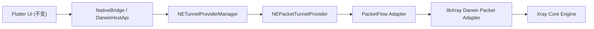

# Packet Tunnel + Xray 可行性设计（Darwin 落地，跨平台预留）

## 1. 目标与约束

本设计用于 `xstream.svc.plus` 的隧道模式微调，明确如下边界：

1. 保持现有 UI 布局与交互不变，仅调整隧道控制面与数据面实现。
2. 系统级网络入口在 Darwin 平台只使用 `NEPacketTunnelProvider`。
3. 统一运行入口保留 `config.json`（可由软链接动态切换至选中节点配置）。
4. 预留 Windows / Linux / Android 的统一扩展位，形成跨平台一致控制面。

## 2. 当前仓库实现现状（可行性基线）

### 2.1 控制面（Darwin）已基本就绪

- Flutter -> Pigeon -> Darwin Host 的链路已存在：
  - `lib/utils/native_bridge.dart`
  - `darwin/MacosHostApi.swift`
- `NETunnelProviderManager` 的 load/save/start/stop 流程已落地：
  - `darwin/MacosHostApi.swift`

### 2.2 Darwin 数据面尚未形成“完整双向包转发”

- `PacketTunnelProvider` 已接入 `NEPacketFlowAdapter` 读包：
  - `ios/PacketTunnel/PacketTunnelProvider.swift`
  - `macos/PacketTunnel/PacketTunnelProvider.swift`
- 但 Go 侧 `SubmitInboundPacket` 目前是占位实现（直接返回，不做实际转发处理）：
  - `go_core/bridge_ios.go`
- 同时未见从 Xray 回写到 `packetFlow.writePackets(...)` 的明确数据回流通道。

结论：Darwin 上“PacketTunnel 直连 libXray 处理 IP 包”当前是**控制面可用、数据面未闭环**。

### 2.3 Android 已有更接近闭环的路径

- Android 存在 `VpnService` + `tun fd` + `StartXrayTunnelWithFd`：
  - `android/app/src/main/kotlin/com/example/xstream/XstreamPacketTunnelService.kt`
  - `go_core/bridge_android.go`
- 这是当前仓库最接近 Xray TUN 数据面闭环的平台实现。

## 3. 关键事实与边界判断

### 3.1 Xray v26 `tun` inbound 的平台边界

依据 Xray 官方文档，`inbounds/tun` 当前标注为仅支持 Linux 与 Windows。

这意味着：

1. 在 macOS / iOS 上，不能把“依赖 Xray 原生 `tun` inbound”作为既定前提。
2. Darwin 要实现 Packet Tunnel 直连 Xray，需要额外的 Darwin 适配层（见第 4 节）。

### 3.2 iOS/macOS 与 Android 的核心差异

- Android `VpnService` 可拿到 TUN 文件描述符（fd），适合 `StartXrayTunnelWithFd`。
- `NEPacketTunnelProvider` 使用的是 `packetFlow` 包接口，不提供等价 fd。

因此，Darwin 不能直接复用 Android 的 fd 模式，需要“包回调/桥接”模式。

## 4. Darwin 目标架构（不改 UI）

### 4.1 设计要点

1. `NEPacketTunnelProvider` 继续作为系统 VPN 唯一入口。
2. `config.json` 继续作为统一运行配置名，通过软链接切换选中节点。
3. 新增 Darwin 包桥接层，实现：
   - `packetFlow.readPackets` -> 提交至 Xray。
   - Xray 产出的下行包 -> `packetFlow.writePackets`。
4. 保持现有 UI 和节点选择流程不变。

### 4.2 建议补充的桥接接口（Darwin 专用）

建议在 Go/C 导出层补充“包回调模式”接口（示意）：

- `StartXrayTunnelWithPacketBridge(configJson, callbacks)`
- `SubmitInboundPacket(handle, packet, protocol)`
- `PollOutboundPacket(handle)` 或回调 `OnOutboundPacket(...)`
- `StopXrayTunnel(handle)`

说明：这是为了适配 `NEPacketTunnelProvider` 的包接口模型。

## 5. 重要风险：TUN 回环（TUN -> TUN loop）

### 5.1 回环触发条件

当默认路由进入 Packet Tunnel，而 Xray 的出站套接字没有绑定物理网卡时，出站流量可能再次被系统送回隧道，造成循环。

### 5.2 规避策略

1. 为关键 outbound 显式设置 egress interface（`streamSettings.sockopt.interface`）。
2. 在 `NEPacketTunnelNetworkSettings` 中维护必要的 `excludedRoutes`，避免上游目标回灌。
3. 启动前检查当前可用物理接口（`NWPathMonitor`），接口变化时触发配置刷新。
4. 启动后做最小自检：路由表、接口、连接矩阵、隧道状态一致性。

## 6. 跨平台预留设计（Windows / Linux / Android）

在不改 UI 的前提下，建议统一抽象：

### 6.1 统一控制面接口

- `saveTunnelProfile(profile)`
- `startTunnel()`
- `stopTunnel()`
- `getTunnelStatus()`

Dart 侧继续复用现有状态模型；各平台实现数据面差异。

### 6.2 平台数据面适配层

- DarwinAdapter（`NEPacketTunnelProvider` + 包桥接）
- AndroidAdapter（`VpnService` + tun fd）
- WindowsAdapter（Wintun + `xray run -c config.json` 或 libXray）
- LinuxAdapter（TUN + `xray run -c config.json` 或 libXray）

### 6.3 统一配置策略

1. 统一产出 `config.json`（软链接指向选中节点配置）。
2. 统一 profile 字段（MTU、DNS、IPv4/IPv6 路由、隧道参数）。
3. 平台适配层只做“网络入口与包桥接”差异，不改配置语义。

## 7. 分阶段落地计划

### Phase 0（当前）

- 保持 UI 不变。
- 固化文档与边界，确认 Darwin 数据面未闭环问题。

### Phase 1（Darwin 数据面闭环）

1. 为 libXray 增加 Darwin 包桥接 API。
2. 在 iOS/macOS `PacketTunnelProvider` 中打通双向包流。
3. 打通停止、异常回滚、状态上报。

### Phase 2（回环防护）

1. 加入 `sockopt.interface` 动态绑定策略。
2. 增强 `excludedRoutes` 生成与验证。
3. 增加启动后快速核验脚本（路由/接口/DNS/连接矩阵）。

### Phase 3（跨平台统一）

1. 抽象 Platform Tunnel Adapter。
2. 对齐 Android 与 Darwin 状态语义。
3. 预留 Windows/Linux 数据面实现位，不影响现有 UI。

## 8. 验收标准

1. 不改 UI 布局与交互，现有功能入口保持不变。
2. Darwin 隧道模式可稳定建立、停止、重连，并可持续传输。
3. 不出现 TUN 回环导致的连接异常。
4. `config.json` 作为统一启动入口，节点切换仅更新软链接。
5. 跨平台控制面接口保持一致，便于 Windows/Linux/Android 扩展。

## 9. 参考

- Xray `tun` inbound 文档：<https://xtls.github.io/en/config/inbound/tun.html>
- Xray `streamSettings.sockopt.interface`：<https://xtls.github.io/en/config/transport.html#streamsettingsobject>
- Apple `NEPacketTunnelProvider` API：<https://developer.apple.com/documentation/networkextension/nepackettunnelprovider>
- Apple `NETunnelProviderManager` API：<https://developer.apple.com/documentation/networkextension/netunnelprovidermanager>

## 10. 迁移文档对照

为保持 UI 不变并推进落地，配套文档如下：

1. 迁移矩阵：`docs/onexray-xstream-migration-matrix.md`
2. 架构主文档：`docs/system-vpn-packet-tunnel-xray26.md`
