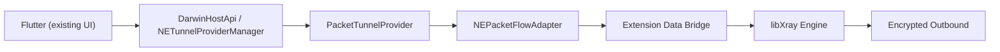

# System VPN + Packet Tunnel + xray-core 26 Integration

## 1) Scope

Xstream uses Apple Network Extension as the only System VPN entry:

- System-level networking entry: `NEPacketTunnelProvider`
- Tunnel engine: `xray-core` (Go bridge)
- Control plane on Darwin: Pigeon `DarwinHostApi`

This design targets long-term compliance, auditability, and maintainability.

## 2) Interface Definition

### 2.1 Dart <-> Darwin Host (Pigeon)

Defined in `pigeons/darwin.dart`, generated to:

- Dart: `lib/app/darwin_host_api.g.dart`
- Swift: `darwin/Messages.g.swift`

Core APIs:

- `savePacketTunnelProfile(TunnelProfile)`
- `startPacketTunnel()`
- `stopPacketTunnel()`
- `getPacketTunnelStatus()`

Status callbacks:

- `onPacketTunnelStateChanged(TunnelStatus)`
- `onPacketTunnelError(String code, String message)`

### 2.2 Swift <-> Go bridge points

Declared in `bindings/bridge.h` and exported in `go_core/bridge_ios.go`:

- `StartXrayTunnel(const char* config) -> long long`
- `SubmitInboundPacket(long long handle, const uint8_t* data, int32_t length, int32_t protocol) -> int32_t`
- `StopXrayTunnel(long long handle) -> char*`
- `FreeXrayTunnel(long long handle) -> char*`
- `FreeCString(char* str) -> void`

`PacketTunnelProvider` resolves these symbols dynamically through `dlsym` in `XrayTunnelBridge`.

## 3) Binding Points

### 3.1 Control plane

- iOS bootstrap: `ios/Runner/AppDelegate.swift`
- macOS bootstrap: `macos/Runner/MainFlutterWindow.swift`
- Darwin host implementation: `darwin/MacosHostApi.swift`
- Dart caller: `lib/utils/native_bridge.dart`

### 3.2 Data plane

- iOS provider: `ios/PacketTunnel/PacketTunnelProvider.swift`
- macOS provider: `macos/PacketTunnel/PacketTunnelProvider.swift`

Key components:

- `NEPacketFlowAdapter` handles packetFlow read/write
- `XrayTunnelEngine` owns tunnel session lifecycle
- `XrayTunnelBridge` maps Swift to Go symbols
- `PacketTunnelStatusStore` persists status in App Group

## 4) Startup Sequence

1. Dart builds `TunnelProfile` and calls `savePacketTunnelProfile`.
2. Dart calls `startPacketTunnel`.
3. `DarwinHostApiImpl` loads/creates `NETunnelProviderManager`, writes latest options, then starts VPN tunnel.
4. `PacketTunnelProvider.startTunnel` resolves options, builds network settings, and applies `setTunnelNetworkSettings`.
5. Provider starts `NEPacketFlowAdapter`.
6. Provider starts `XrayTunnelEngine`:
   - `StartXrayTunnel(config)` returns session handle
   - packetFlow inbound packets are pushed by `SubmitInboundPacket`
7. Status is persisted and emitted back to Flutter with `TunnelStatus`.

## 5) Failure Rollback Path

### 5.1 Control-plane failures (`DarwinHostApiImpl`)

- Manager load/save/start failures:
  - write `packet_tunnel_last_error`
  - emit `onPacketTunnelError`
  - return failure to caller

### 5.2 Provider startup failures (`PacketTunnelProvider`)

- If engine start fails after network settings:
  - stop adapter
  - stop engine
  - cancel path monitor
  - clear active settings cache
  - persist error via `PacketTunnelStatusStore`
  - complete start with error

### 5.3 Stop path

- `stopTunnel` always:
  - cancel monitor
  - stop adapter
  - stop engine (`StopXrayTunnel` + `FreeXrayTunnel`)
  - clear connected timestamp

## 6) Runtime State Keys (App Group)

- `packet_tunnel_profile_options`
- `packet_tunnel_last_error`
- `packet_tunnel_started_at`

## 7) Build Verification Baseline

- `PacketTunnel` targets compile on iOS and macOS.
- Runner full build requires writable Flutter workspace metadata (`.dart_tool` and generated artifacts).

## 8) App Architecture Update (UI Unchanged)

The current migration target keeps all existing UI entry points unchanged and upgrades only native networking internals.

### 8.1 Unified control plane (no UI change)

Existing UI actions remain:

1. `startNodeService` / `stopNodeService` for local proxy mode.
2. `startPacketTunnel` / `stopPacketTunnel` for System VPN mode.

No Flutter page layout or user workflow changes are required.

### 8.2 Runtime modes

Mode A: `Proxy Mode`

1. Dart triggers local engine start.
2. `xray-core` runs local SOCKS/HTTP inbounds.
3. App traffic enters local proxy and goes to encrypted outbounds.

Mode B: `Tunnel Mode` (System VPN)

1. Dart triggers `NETunnelProviderManager`.
2. `PacketTunnelProvider` applies network settings and owns `utun`.
3. Data plane inside extension bridges packet flow to the tunnel engine.

### 8.3 Target data-plane shape in Tunnel Mode

## 9) OneXray-to-Xstream mapping

For step-by-step migration mapping and ownership, see:

- `docs/onexray-xstream-migration-matrix.md`

This mapping is used to migrate implementation details while preserving current UI behavior.

## 10) Implementation decision for Darwin data plane

Given the current repository state:

1. Control plane is already stable.
2. `SubmitInboundPacket` in `go_core/bridge_ios.go` is still a placeholder.

Recommended sequence:

1. First close data path with extension-local proxy bridge (SOCKS/HTTP to libXray) while keeping `PacketTunnelProvider` as the sole system entry.
2. Then iterate toward deeper packet bridge integration once Darwin adapter capabilities are verified in `go_core`.

## 11) Loop prevention baseline

To avoid tunnel loop (`TUN -> TUN`), enforce:

1. Explicit egress binding on key outbounds (`streamSettings.sockopt.interface` when available).
2. Managed `excludedRoutes` in Packet Tunnel profile.
3. Startup/runtime checks for route table, active interface, and connection matrix consistency.
