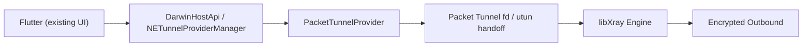

# System VPN + Packet Tunnel + xray-core 26 Integration

## 1) Scope

Xstream uses Apple Network Extension as the only System VPN entry:

- System-level networking entry: `NEPacketTunnelProvider`
- Tunnel engine: `xray-core` (Go bridge)
- Control plane on Darwin: Pigeon `DarwinHostApi`

This design targets long-term compliance, auditability, and maintainability.

## 2) Interface Definition

### 2.1 Dart <-> Darwin Host (Pigeon)

Defined in `pigeons/darwin.dart`, generated to:

- Dart: `lib/app/darwin_host_api.g.dart`
- Swift: `darwin/Messages.g.swift`

Core APIs:

- `savePacketTunnelProfile(TunnelProfile)`
- `startPacketTunnel()`
- `stopPacketTunnel()`
- `getPacketTunnelStatus()`
- `getPacketTunnelMetrics()`

Status callbacks:

- `onPacketTunnelStateChanged(TunnelStatus)`
- `onPacketTunnelError(String code, String message)`

### 2.2 Swift <-> Go bridge points

Declared in `bindings/bridge.h` and exported in `go_core/bridge_ios.go`:

- `StartXrayTunnelWithFd(const char* config, int fd, const char* egressInterface) -> long long`
- `GetLastXrayTunnelError() -> char*`
- `StopXrayTunnel(long long handle) -> char*`
- `FreeXrayTunnel(long long handle) -> char*`
- `FreeCString(char* str) -> void`

On iOS, `PacketTunnelProvider` links these symbols statically from `build/ios/libxray.a` and calls them directly through the PacketTunnel bridging header. macOS keeps its existing dynamic bridge path.

## 3) Binding Points

### 3.1 Control plane

- iOS bootstrap: `ios/Runner/AppDelegate.swift`
- macOS bootstrap: `macos/Runner/MainFlutterWindow.swift`
- Darwin host implementation: `darwin/MacosHostApi.swift`
- Dart caller: `lib/utils/native_bridge.dart`

### 3.2 Data plane

- iOS provider: `ios/PacketTunnel/PacketTunnelProvider.swift`
- macOS provider: `macos/PacketTunnel/PacketTunnelProvider.swift`

Key components:

- `XrayTunnelEngine` owns tunnel session lifecycle
- `XrayTunnelBridge` maps Swift to Go symbols
- `PacketTunnelStatusStore` persists status in App Group

## 4) Startup Sequence

1. On iOS app launch, Flutter now proactively saves a baseline Packet Tunnel profile so the System VPN entry can appear before the first node import.
2. Dart builds `TunnelProfile` and calls `savePacketTunnelProfile`.
3. On iOS, the runtime tunnel config is normalized into the App Group shared container so the host app and `PacketTunnel` extension use the same config path.
4. On iOS, `DarwinHostApiImpl` also loads/creates `NETunnelProviderManager` during profile save so `Xstream` becomes visible in the system VPN list before connection starts.
5. Dart calls `startPacketTunnel`.
6. `DarwinHostApiImpl` refreshes `NETunnelProviderManager` with latest options, then starts VPN tunnel.
7. `PacketTunnelProvider.startTunnel` resolves options, builds network settings, and applies `setTunnelNetworkSettings`.
8. Provider resolves the active Packet Tunnel fd / `utun` handle inside the extension process.
9. Provider starts `XrayTunnelEngine` with `StartXrayTunnelWithFd(config, fd, egressInterface)`.
10. Status is persisted and emitted back to Flutter with `TunnelStatus`.

There is no separate Darwin startup path that launches the tunnel engine without the Packet Tunnel fd. If fd handoff fails, provider startup fails and reports that error back through the shared status path.

### 4.1 iOS static-link baseline

For iOS only:

1. `build_scripts/build_ios_xray.sh` builds `build/ios/libxray.a`
2. `PacketTunnel` target runs this script during Xcode build
3. `PacketTunnel.appex` force-loads `libxray.a`
4. `PacketTunnelProvider` calls the bridge exports directly after `setTunnelNetworkSettings(...)`

This keeps the iOS Secure Tunnel data plane fully inside the `PacketTunnel` extension process and avoids runtime `dylib` discovery in the extension.

## 5) Failure Rollback Path

### 5.1 Control-plane failures (`DarwinHostApiImpl`)

- Manager load/save/start failures:
  - write `packet_tunnel_last_error`
  - emit `onPacketTunnelError`
  - return failure to caller

### 5.2 Provider startup failures (`PacketTunnelProvider`)

- If engine start fails after network settings:
  - stop engine
  - cancel path monitor
  - clear active settings cache
  - persist error via `PacketTunnelStatusStore`
  - complete start with error

### 5.3 Stop path

- `stopTunnel` always:
  - cancel monitor
  - stop engine (`StopXrayTunnel` + `FreeXrayTunnel`)
  - clear connected timestamp

## 6) Runtime State Keys (App Group)

- `packet_tunnel_profile_options`
- `packet_tunnel_last_error`
- `packet_tunnel_started_at`
- `packet_tunnel_metrics_snapshot`

### 6.1 Darwin home monitoring snapshot

To keep the control plane stable, Apple home monitoring uses a one-way snapshot path:

1. `PacketTunnelProvider` samples tunnel runtime data inside the extension process.
2. The provider writes a compact latest-value snapshot into App Group shared state.
3. Darwin Host bridge reads that snapshot.
4. Flutter Home screen uses the snapshot only for the monitoring card area.

This path is intentionally narrow:

- It does not change `NETunnelProviderManager` startup semantics.
- It does not add a new local proxy or sidecar process.
- It does not require Flutter UI to know about extension internals.

Recommended snapshot fields:

- `downloadBytesPerSecond`
- `uploadBytesPerSecond`
- `memoryBytes`
- `cpuPercent`
- `updatedAt`

Latency stays on the Flutter-side active-connection probe path and is rendered in milliseconds on the Home cards. macOS now samples extension-process CPU from the Packet Tunnel runtime snapshot, while iOS CPU may remain unavailable until there is a stable and low-risk sampling method.

## 7) Build Verification Baseline

- `PacketTunnel` targets compile on iOS and macOS.
- Runner full build requires writable Flutter workspace metadata (`.dart_tool` and generated artifacts).

## 8) App Architecture Update (UI Unchanged)

The current migration target keeps all existing UI entry points unchanged and upgrades only native networking internals.

### 8.1 Unified control plane (no UI change)

Existing UI actions remain:

1. `startNodeService` / `stopNodeService` for local proxy mode.
2. `startPacketTunnel` / `stopPacketTunnel` for System VPN mode.

No Flutter page layout or user workflow changes are required.

### 8.2 Runtime modes

Mode A: `Proxy Mode`

1. Dart triggers local engine start.
2. `xray-core` runs local SOCKS/HTTP inbounds.
3. App traffic enters local proxy and goes to encrypted outbounds.

Mode B: `Tunnel Mode` (System VPN)

1. Dart triggers `NETunnelProviderManager`.
2. `PacketTunnelProvider` applies network settings and owns the system `utun`.
3. The provider hands the live Packet Tunnel fd to `xray-core`.

### 8.3 Target data-plane shape in Tunnel Mode

```mermaid
flowchart LR
  A["Flutter (existing UI)"] --> B["DarwinHostApi / NETunnelProviderManager"]
  B --> C["PacketTunnelProvider"]
  C --> D["Packet Tunnel fd / utun handoff"]
  D --> E["libXray Engine"]
  E --> F["Encrypted Outbound"]
```

## 9) OneXray-to-Xstream mapping

For step-by-step migration mapping and ownership, see:

- `docs/onexray-xstream-migration-matrix.md`

This mapping is used to migrate implementation details while preserving current UI behavior.

## 10) Implementation decision for Darwin data plane

Given the current repository state:

1. Control plane is already stable.
2. Darwin Packet Tunnel startup now depends on valid fd handoff from `PacketTunnelProvider` to `StartXrayTunnelWithFd`.

Recommended sequence:

1. Keep `NEPacketTunnelProvider` as the sole Apple system entry.
2. Treat fd handoff failures as first-class startup errors and diagnose them before engine changes.

## 11) Loop prevention baseline

To avoid tunnel loop (`TUN -> TUN`), enforce:

1. Explicit egress binding on key outbounds (`streamSettings.sockopt.interface` when available).
2. Managed `excludedRoutes` in Packet Tunnel profile.
3. Startup/runtime checks for route table, active interface, and connection matrix consistency.
